[](https://github.com/htilly/SlackONOS/actions?query=workflow%3A%22Node.js+CI%22)
[](https://snyk.io/test/github/htilly/SlackONOS)


# SlackONOS - Democratic Music Bot for Discord & Slack

**Control Your Sonos Speakers with Community Voting**

A democratic music bot for Discord and Slack that lets teams control Sonos speakers with Spotify integration. Features community voting, democratic skip tracking with "gong" commands, and seamless multi-platform support.

🎵 **Perfect for:** Offices, shared spaces, gaming communities, Discord servers, and music lovers who want fair queue control

✨ **Key Features:**
- 🤖 **AI Natural Language** - Talk naturally! "@bot play the best songs by Queen" (NEW!)
- 🗳️ **Democratic Voting** - Community decides what plays next with vote-to-play system
- 🔔 **Gong System** - Skip tracks democratically when enough users vote to gong
- 🎮 **Discord Support** - Full emoji reaction voting (🎵 to vote, 🔔 to gong)
- 💬 **Slack Integration** - Modern Socket Mode support with channel-based permissions
- 🎶 **Spotify Integration** - Search and queue tracks, albums, and playlists
- 👥 **Multi-Platform** - Run Discord and Slack simultaneously on one Sonos system
- 🎯 **Role-Based Permissions** - Admin controls for flush, volume, and queue management
- 🚫 **Gong Ban System** - Tracks voted down become immune to re-queuing
- 🎛️ **Soundcraft Ui24R Support** - Control mixer volume on multiple buses directly from chat (NEW!)
- 🔐 **WebAuthn/FIDO2 Security** - Passwordless login with Yubikey, Touch ID, or Face ID (NEW!)
- 🎨 **Modern Web Interface** - Beautiful setup wizard and admin panel with real-time updates (NEW!)

## Screenshots


*Live music playback control and queue management*


*Live music playback control and queue management*


*Admin settings in the dedicated admin-channel*


*Discord and Slack integration*


*Configure your integrations with auto-validation*


*Secure login with WebAuthn/FIDO2 support*


## License & Commercial Use

SlackONOS is licensed under the **GNU Affero General Public License v3 (AGPL-3.0-or-later)**.

- You may use, modify and redistribute this software under the terms of the AGPL-3.0 license.
- If you run a modified version as a network service, you must make the corresponding source code available to users.
- Commercial entities that wish to use SlackONOS without AGPL obligations (e.g. closed-source forks or proprietary integrations) may contact the author to discuss **separate commercial licensing**.

See the `LICENSE` file for full details.

## Privacy & Telemetry

**SlackONOS respects your privacy.** Optional anonymous telemetry helps us understand usage and improve the bot.

**What's Collected (Anonymous Only):**
- ✅ Startup, heartbeat (24h), and shutdown events
- ✅ Uptime duration (hours/days running)
- ✅ OS platform & Node.js version
- ✅ Release version/commit hash
- ✅ Anonymous instance ID (random UUID, persisted in config - no PII)

**What's NOT Collected:**
- ❌ No user data, usernames, or chat messages
- ❌ No Slack/Discord server information
- ❌ No song titles, playlists, or listening history
- ❌ No IP addresses or location data
- ❌ No command usage or voting patterns


Telemetry is **enabled by default** but can be disabled anytime:
```json
{
  "telemetryEnabled": false
}
```

Or, disable telemetry instantly from Slack (admin channel):
```
setconfig telemetryEnabled false
```

📖 **[Full Telemetry Documentation](docs/TELEMETRY.md)** - Details, privacy info, and self-hosting options


Use the `telemetry` admin command in Slack (admin channel) to view current status and what data is being sent.

**Note:** Analytics data is not publicly viewable; it is only accessible to the maintainers for improving the bot. If you self-host, you control all telemetry endpoints.

## Quick Start

### 🚀 Web-Based Setup Wizard (Recommended)

**The easiest way to set up SlackONOS!**

1. Start SlackONOS: `npm install && node index.js`
2. Open your browser: `http://localhost:8181/setup` (or `http://YOUR_SERVER_IP:8181/setup`)
3. Follow the interactive wizard to configure:
   - **Platform Selection** - Choose Slack, Discord, or both
   - **Slack Configuration** - Tokens with auto-validation
   - **Discord Configuration** - Bot token and channel setup
   - **Sonos Device** - Auto-discovery or manual IP configuration
   - **Spotify Integration** - Credentials with region selection
   - **Admin Password** - Set your admin password for web access
4. Save and restart - you're done!

**Features:**
- ✅ Real-time validation of all tokens and credentials
- ✅ Auto-discovery of Sonos devices on your network
- ✅ Beautiful, modern UI with Slack-inspired design
- ✅ Pre-fills existing configuration values to prevent accidental changes
- ✅ Comprehensive error messages and helpful tooltips

**What You Need:**
1. A Sonos speaker configured with Spotify
2. A Slack bot token **OR** Discord bot token (or both!)
3. A server running Node.js
4. Static IP address for your Sonos speaker (or use auto-discovery)
5. Spotify Developer credentials (Client ID & Secret) from https://developer.spotify.com/dashboard/applications

**Docker Installation (Recommended)**

```yaml
services:
  slackonos:
    container_name: slackonos
    image: htilly/slackonos:latest
    restart: unless-stopped
    volumes:
      - /PATH_TO_CONFIG_FOLDER:/app/config
    ports:
      - "8181:8181"  # HTTP (redirectar)
      - "8443:8443"  # HTTPS (faktiska förfrågningar)
    # Optional: Use host network for better Sonos discovery
    # network_mode: "host"
```

After starting the container, access the setup wizard at:
- HTTP: `http://localhost:8181/setup` (redirects to HTTPS if SSL is enabled)
- HTTPS: `https://localhost:8443/setup` (if SSL certificates are configured)

📖 **[Complete Discord Setup Guide](docs/discord/SETUP.md)** - Step-by-step Discord bot configuration

📖 **[Complete Slack Setup Guide](docs/SLACK.md)** - Socket Mode Slack bot setup (tokens, scopes, events)

🎛️ **[Soundcraft Ui24R Integration](docs/SOUNDCRAFT.md)** - Control mixer volume directly from Slack/Discord

### 🎮 Discord Invite Link

**Add SlackONOS to your Discord server:**

1. Go to the [Discord Developer Portal](https://discord.com/developers/applications)
2. Select your application
3. Get your Client ID from the "OAuth2" section
4. Use this invite link (replace `YOUR_CLIENT_ID`):

```
https://discord.com/oauth2/authorize?client_id=YOUR_CLIENT_ID&permissions=274878024768&scope=bot%20applications.commands
```

**Required Permissions:**
- Read Messages/View Channels
- Send Messages  
- Add Reactions
- Read Message History
- Use External Emojis

**💡 Tip:** After setup, use the `debug` command to get your bot's pre-configured invite link!

---

## How It Works

SlackONOS is a democratic music bot that gives communities fair control over shared Sonos speakers. Instead of one person controlling the music, everyone can participate through voting and democratic skip features.

**Uses [node-sonos](https://github.com/bencevans/node-sonos) for Sonos control.**

### Platform Support
- ✅ **Slack** - Modern Socket Mode with channel-based admin permissions
- ✅ **Discord** - Full support with role-based admin + emoji reaction voting
- 🎵 **Shared Queue** - Both platforms control the same Sonos speaker simultaneously
- 🗳️ **Cross-Platform Democracy** - Gong and vote systems work across all platforms

### Network Requirements

**Firewall Settings:**
- Server must reach Sonos on port **1400 (TCP)**
- Sonos must have internet access for Spotify streaming
- Recommended: Static IP for Sonos speaker

**Configuration**
You must provide the token of your Slack bot and the IP of your Sonos in either config.json (see config.json.example), as arguments or as environment variables.
Examples:
```bash
node index.js --legacySlackBotToken "MySlackBotToken" --sonos "192.168.0.1"
```
or
```bash
legacySlackBotToken="MySlackBotToken" sonos="192.168.0.1" node index.js
```
You can also provide any of the other variables from config.json.example as arguments or environment variables.
The blacklist can be provided as either an array in config.json, or as a comma-separated string when using arguments or environment variables.

**Channel Configuration (Important for Large Workspaces)**

SlackONOS uses two channels: `adminChannel` (for admin commands) and `standardChannel` (for regular users).

**For workspaces with 100+ channels:** Use channel IDs instead of channel names to avoid Slack API rate limits during startup.

- **Channel names** (default): `"adminChannel": "music-admin"` → Bot scans all channels to find ID (slow, but **auto-upgrades to IDs after first run**)
- **Channel IDs** (recommended): `"adminChannel": "C01ABC123XY"` → Direct lookup (instant)

**🎉 NEW: Auto-save Feature**

If you configure channel names, SlackONOS will automatically update your `config.json` with the discovered IDs after the first successful startup. This means:
- **First startup**: Slow (1-3 minutes in large workspaces)
- **All future startups**: Instant (uses saved IDs)

**Manual Configuration (Optional)**

You can also manually set channel IDs to skip the first slow startup.

**How to find Channel IDs:**
1. In Slack web/desktop, right-click the channel
2. Select "View channel details"
3. Scroll to bottom, copy the Channel ID (format: `C` + 9+ alphanumeric characters)

Example config.json:
```json
{
  "adminChannel": "C01ABC123XY",
  "standardChannel": "C987DEF654",
  ...
}
```

Logo for the bot in #Slack can be found at "doc/images/SlackONOS.png

**⚠️ BREAKING CHANGES (v2.0+)**

**Socket Mode Migration**

As of v2.0, SlackONOS has migrated from the deprecated RTM API to **Socket Mode** for improved reliability and performance. This requires new configuration:

**Required Changes:**
1. **New App-Level Token Required**: You MUST create an app-level token (starts with `xapp-`) in your Slack app settings
2. **Socket Mode Must Be Enabled**: Enable Socket Mode in your Slack app configuration
3. **Updated Configuration**: Both `slackAppToken` (app-level) and `token` (bot token, `xoxb-`) are now required

**Migration Steps:**

1. Go to https://api.slack.com/apps/YOUR_APP_ID/socket-mode
2. Enable Socket Mode
3. Generate an app-level token with `connections:write` scope
4. Add the token to your `config.json`:
   ```json
   {
     "slackAppToken": "xapp-1-A0...",
     "token": "xoxb-123...",
     ...
   }
   ```

**Legacy Bot Token Support**

⚠️ Legacy bot tokens are **deprecated** and no longer supported as of v2.0. You must migrate to Socket Mode.

- Legacy bots can [no longer be created](https://api.slack.com/changelog/2024-09-legacy-custom-bots-classic-apps-deprecation)
- If you were using `legacySlackBotToken`, you must create a new Slack app and configure it with Socket Mode
- The `useLegacyBot` configuration option has been removed

**Architectural Improvements (v2.0)**

SlackONOS v2.0 includes significant architectural improvements:

- **Modular Design**: Slack and Spotify integrations are now separate, clean modules (`slack.js`, `spotify-async.js`)
- **Non-Blocking Operations**: All Spotify API calls use async/await with native `fetch`, eliminating blocking operations
- **Declarative Command Registry**: Commands are defined in a clean, maintainable registry instead of large switch statements
- **Improved Error Handling**: Centralized error handling and logging for better debugging
- **Robust Event Handling**: Better filtering and processing of Slack events
- **Network Resilience**: Increased ping timeouts to handle network latency better

**What can it do?**

### 🤖 AI Natural Language (NEW!)

**Talk to the bot naturally** by mentioning it in Slack or Discord! No need to remember exact commands.

**Examples:**
- `@SlackONOS play the best songs by U2` → Queues U2's top tracks
- `@bot add Forever Young` → Adds the song to queue
- `@SlackONOS what's playing?` → Shows current track
- `@bot skip this terrible song` → Gongs the current track
- `@SlackONOS show me the queue` → Lists all queued tracks

**🎉 Batch Add with Smart Themes (NEW!):**
- `@SlackONOS add some christmas music` → Adds 5 holiday tracks
- `@bot play a few summer hits` → Queues summer beach songs
- `@SlackONOS give me 10 80s classics` → Adds ten 80s hits
- `@bot spela lite partylåtar` → Queues party music (works in Swedish!)

**Quantity Words:**
| Phrase | Tracks Added |
|--------|--------------|
| "a couple", "ett par" | 2 |
| "a few", "några" | 3-4 |
| "some", "lite", "several" | 5 |
| "many", "lots", "massa" | 8 |
| "10", "fifteen", etc. | Exact number |

**Smart Theme Boosters:**
The AI automatically enhances searches based on detected themes:

| Theme | Triggers | Search Enhancement |
|-------|----------|-------------------|
| 🎄 Christmas | `jul`, `xmas`, `christmas` | +christmas holiday |
| 🎉 Party | `party`, `fest`, `dansband` | +party upbeat |
| 😌 Chill | `chill`, `relax`, `lugn`, `mysig` | +chill mellow |
| 💪 Workout | `workout`, `gym`, `träning` | +workout energetic |
| ☀️ Summer | `sommar`, `summer`, `beach` | +summer beach hits |
| 📼 80s | `80s`, `80-tal`, `eighties` | +80s classic hits |
| 💿 90s | `90s`, `90-tal`, `nineties` | +90s classic hits |
| 🎸 Rock | `rock`, `metal` | +rock classic |
| 🎵 Pop | `pop`, `hits` | +pop hits |
| 🕺 Disco | `disco`, `funk` | +disco dance funk |
| 💕 Ballads | `ballad`, `kärleks`, `love` | +ballad love romantic |
| 🎤 Hip-hop | `hip hop`, `rap`, `hiphop` | +hip hop rap hits |
| 🤠 Country | `country`, `nashville` | +country hits |
| 🎷 Jazz | `jazz`, `blues` | +jazz blues classic |
| 🎻 Classical | `klassisk`, `classical`, `opera` | +classical orchestra |
| 🌴 Reggae | `reggae`, `ska`, `caribbean` | +reggae caribbean |
| 🎧 Indie | `indie`, `alternative` | +indie alternative |
| 🔊 EDM | `edm`, `electro`, `house`, `techno` | +electronic dance |
| 💃 Latin | `latin`, `salsa`, `bachata` | +latin dance |
| 🇸🇪 Swedish | `svensk`, `swedish` | +swedish svenska |
| 👶 Kids | `barnlåt`, `kids`, `children` | +children kids |

**Auto-Play Behavior:**
- If music is **playing**: New tracks are added to the queue
- If music is **stopped**: Queue is cleared, tracks added, and playback starts automatically

### 🌟 Seasonal & Venue Themes (NEW!)

The AI automatically knows the current season and can suggest themed music!

**Seasonal Awareness:**
The bot detects the current month and adjusts music suggestions:

| Season | Period | Themes |
|--------|--------|--------|
| 🎄 Winter/Holiday | December - Jan 6 | Christmas, holiday classics |
| 🎃 Halloween | Oct 15-31 | Spooky, horror soundtracks |
| ☀️ Summer | June - August | Beach vibes, feel-good hits |
| 🌸 Spring | March - May | Uplifting, fresh vibes |
| 💕 Valentine's | Feb 10-14 | Love songs, romantic ballads |
| 🍂 Autumn | Sept - Nov (early) | Cozy, acoustic, nostalgic |
| ❄️ Winter | Jan 7+, Feb | Cozy, chill, warming |

**Example:** In December, asking for "add some seasonal music" will automatically queue Christmas tracks!

**Venue/Default Theme:**
Configure a default theme for your venue that subtly influences all bulk music requests:

```
setconfig defaultTheme lounge
setconfig themePercentage 30
```

| Setting | Values | Description |
|---------|--------|-------------|
| `defaultTheme` | `lounge`, `club`, `office`, `cafe`, etc. | Base music style for your venue |
| `themePercentage` | 0-100 | Percentage of tracks matching venue theme |

**How it works:**
When you request "100 christmas songs" with `defaultTheme: lounge` and `themePercentage: 30`:
- ~70 christmas songs (what you asked for)
- ~30 lounge-style tracks (venue atmosphere)

This ensures your venue's vibe is always maintained, even during themed requests!

**How it works:**
- Powered by OpenAI GPT-4o-mini for accurate command parsing
- Understands natural language in multiple languages (Swedish, English, etc.)
- Falls back to regular commands if AI is disabled
- Optional feature - works without AI if no API key is provided

**Setup:**
1. Get an OpenAI API key from https://platform.openai.com/api-keys
2. Add to `config.json`: `"openaiApiKey": "sk-proj-..."`
3. That's it! Start mentioning the bot naturally

**Note:** AI parsing only activates when you @mention the bot with text that doesn't start with a known command. Regular commands (like `add song name`) still work instantly without AI.

---

### 🔐 WebAuthn/FIDO2 Security (NEW!)

**Passwordless authentication with hardware security keys!**

SlackONOS now supports WebAuthn/FIDO2 for secure, passwordless login to the admin panel. Use your Yubikey, Touch ID, or Face ID to log in securely.

**Features:**
- 🔑 **Hardware Security Keys** - Support for Yubikey and other FIDO2 keys
- 👆 **Biometric Authentication** - Touch ID (macOS) and Face ID (iOS) support
- 🎛️ **Flexible Configuration** - Choose between platform-only (Touch ID) or cross-platform (Yubikey) authenticators
- ⚙️ **Advanced Settings** - Configure timeout, challenge expiration, resident keys, and more
- 🔒 **Secure by Default** - Password fallback available if no credentials are registered

**Setup:**
1. Log in to the admin panel with your password
2. Navigate to the **Security** section
3. Click **Register New Security Key**
4. Follow the browser prompts to register your key
5. Next time you log in, use **"Login with Yubikey!"** button

**Configuration Options:**
- **Require User Verification** - Enable PIN for Yubikey or biometric for Touch ID/Face ID
- **Prefer Platform Only** - Restrict to Touch ID/Face ID only (reduces QR code prompts on macOS/iOS)
- **Timeout** - Registration/authentication timeout (10-300 seconds)
- **Challenge Expiration** - How long challenges remain valid (30-300 seconds)
- **Resident Key Preference** - Control passkey support (discouraged/preferred/required)
- **Max Credentials** - Limit number of registered keys per user

**Admin Panel Security:**
- Collapsible Security section with all authentication settings
- Change password functionality integrated into Security section
- Real-time credential management (view, register, delete keys)
- Secure credential storage in `webauthn-credentials.json`

---

### Democratic Music Control

**Community Queue Management:**
The bot queues song requests and plays them in order. If enough people dislike the current track, they can use the "**gong**" command to democratically skip it.

### User Commands

**Music Control:**
* `add <song/artist/album>` - Add music to the queue and start playing
* `search <text>` - Search for tracks without adding to queue
* `bestof <artist>` - Queue the top 10 tracks by an artist
* `current` - Show currently playing track with time remaining
* `list` - Display the current queue
* `status` - Show playback status

**Democratic Features:**
* `gong` - Vote to skip the current track (requires multiple votes)
* `vote <track number>` - Vote to move a queued track up in priority
* `gongcheck` - See current gong votes and who voted
* `votecheck` - See current vote counts for tracks
* `volume` - View current volume level

**Discord Emoji Reactions:**
* 🎵 - Vote for a track (click on "Added..." messages)
* 🔔 - Gong/skip a track (click on "Added..." messages)

### Admin Commands

**Queue Management:**
* `flush` - Clear the entire queue
* `next` - Skip to next track immediately
* `previous` - Go back to previous track
* `shuffle` - Shuffle the playlist

**Playback Control:**
* `play` - Resume playback
* `stop` - Stop playback
* `setvolume <number>` - Set Sonos volume (0-100)
* `setvolume <channel> <number>` - Set Soundcraft mixer channel volume (if enabled)

**System:**
* `blacklist add <@user>` - Prevent user from adding songs
* `blacklist remove <@user>` - Restore user permissions
* `blacklist list` - Show blacklisted users
* `setconfig` - View/change runtime settings (gongLimit, voteLimit, defaultTheme, etc.)
* `configdump` - Show all current configuration values including AI theme context
* `aiunparsed [N]` - Show last N unparsed AI commands (default: 10)

### 🌐 Web Admin Panel

**Modern web interface for managing your bot!**

Access the admin panel at `http://localhost:8181/admin` (or `https://YOUR_SERVER:8443/admin` with HTTPS).

**Features:**
- 📊 **Real-Time Status** - Live monitoring of bot status, Sonos connection, and platform integrations
- 🎵 **Now Playing** - Current track information with playback controls (play, pause, stop)
- 📋 **Queue Management** - View upcoming tracks and manage the queue
- ⚙️ **Configuration** - Collapsible section for viewing and editing runtime settings
- 🔐 **Security** - Collapsible section with:
  - Password change functionality
  - WebAuthn/FIDO2 key registration and management
  - Security settings configuration
- 📜 **Console Logs** - Real-time log streaming with filtering and search
- 🔄 **Auto-Refresh** - Server-Sent Events (SSE) for real-time updates without polling

**Authentication:**
- Password-based login (default)
- WebAuthn/FIDO2 passwordless login (optional, requires registration)
- Secure session management
- Auto-redirect to login on session expiration

---

## Use Cases

**Perfect for:**
- 🏢 **Office Environments** - Democratic music control for shared workspaces
- 🎮 **Discord Communities** - Music bot for gaming servers and communities
- 🏠 **Shared Living Spaces** - Fair queue management for roommates
- 🎉 **Events & Parties** - Let guests control the music democratically
- ☕ **Cafes & Lounges** - Customer-influenced playlists with admin oversight

---

## Installation & Setup

For detailed installation instructions, see the [INSTALL](INSTALL) file.

For Discord-specific setup, see the **[Discord Setup Guide](docs/DISCORD.md)**.

**Wiki:** https://github.com/htilly/SlackONOS/wiki

---

## Contributing

Contributions are welcome! Please feel free to submit pull requests, report bugs, or suggest features.

**Development:**
- Run tests: `npm test`
- Docker build: `docker build -t slackonos .`
- See [TESTING.md](docs/TESTING.md) for test workflow information

---

## AI Code Agent (Experimental)

SlackONOS includes an experimental AI agent that can make autonomous code improvements. The agent can be triggered from Slack/Discord by admins, runs in GitHub Actions, and creates pull requests after tests pass.

### How It Works

```mermaid
sequenceDiagram
    participant Admin as Admin (Slack/Discord)
    participant Bot as SlackONOS Bot
    participant GitHub as GitHub API
    participant Actions as GitHub Actions
    participant OpenAI as OpenAI (GPT-4)
    
    Admin->>Bot: aicode fix the help DM error
    Bot->>GitHub: POST repository_dispatch
    Bot->>Admin: "🤖 Agent triggered!"
    Actions->>OpenAI: Generate code changes
    Actions->>Actions: Apply patch
    Actions->>Actions: Run npm test
    alt Tests Pass
        Actions->>GitHub: Create PR
        Actions->>Bot: Webhook: PR created
        Bot->>Admin: "✅ PR #123 ready for review"
    else Tests Fail
        Actions->>Bot: Webhook: Failed
        Bot->>Admin: "❌ Agent failed"
    end
```



### Usage (Admin Only)

```
aicode <task description>
```

**Examples:**
- `aicode fix the help DM error handling`
- `aicode improve Spotify search relevance`
- `aicode add JSDoc comments to voting functions`
- `aicode update README with new Discord features`

### Requirements

**GitHub Configuration:**
1. Generate GitHub personal access token with `repo` scope
2. Add to `config/config.json`:
   ```json
   {
     "githubToken": "ghp_..."
   }
   ```

**GitHub Secrets (Repository Settings):**

**AI Provider (choose one):**
- **Claude (Recommended - FREE tier!):** `ANTHROPIC_API_KEY` or `CLAUDE_API_KEY`
  - Get key: https://console.anthropic.com/ ($5 free credit!)
  - Set `AI_PROVIDER=claude` (optional, default)
- **Google Gemini (FREE tier!):** `GEMINI_API_KEY` or `GOOGLE_API_KEY`
  - Get key: https://aistudio.google.com/app/apikey
  - Set `AI_PROVIDER=gemini`
- **OpenAI (paid):** `OPENAI_API_KEY`
  - Get key: https://platform.openai.com/api-keys
  - Set `AI_PROVIDER=openai`

**Required:**
- `SLACK_WEBHOOK_URL` - Incoming webhook URL for Slack notifications

**Setup Steps:**
1. Go to GitHub Settings → Developer Settings → Personal Access Tokens
2. Generate new token (classic) with `repo` scope
3. Add token to your `config/config.json` as `githubToken`
4. Create a Slack incoming webhook: https://api.slack.com/messaging/webhooks
5. Add webhook URL to GitHub repository secrets as `SLACK_WEBHOOK_URL`
6. **Choose AI Provider:**
   - **Claude (Recommended):** Get key from https://console.anthropic.com/ → Add as `ANTHROPIC_API_KEY` → (Optional) Set `AI_PROVIDER=claude`
   - **Gemini:** Get key from https://aistudio.google.com/app/apikey → Add as `GEMINI_API_KEY` → Set `AI_PROVIDER=gemini`
   - **OpenAI:** Get key from https://platform.openai.com/api-keys → Add as `OPENAI_API_KEY` → Set `AI_PROVIDER=openai`

### Safety Features

**Admin-Only Access:**
- Command only works in admin channel
- All requests logged with username and timestamp

**Test Gate:**
- PR only created if `npm test` passes
- Failed tests prevent PR creation

**Manual Review:**
- All changes go through PR review process
- Never auto-merges to develop/master

**Scope Limits:**
- Agent instructed to avoid auth/config/security files
- Maximum 300 lines changed per request
- Forbidden file patterns enforced:
  - `webauthn-handler.js`
  - `auth-handler.js`
  - `config/*.json`

**Code Quality:**
- Agent follows project `.cursorrules`
- Uses `logger` instead of `console.log`
- Follows CommonJS and async/await patterns
- Respects existing code style

### Example Workflow

1. Admin types in admin channel:
   ```
   aicode add better error messages to Spotify search
   ```

2. Bot responds:
   ```
   🤖 AI agent triggered!
   Task: add better error messages to Spotify search
   Working on it...
   ```

3. GitHub Actions runs:
   - Checks out `develop` branch
   - Calls OpenAI to generate code changes
   - Applies changes and runs tests
   - Creates PR if tests pass

4. Bot notifies:
   ```
   ✅ AICODE PR created: #193
   Review the changes carefully before merging.
   ```

### Limitations

- **Experimental feature** - Use with caution
- Only works for code changes, not infrastructure
- Limited to 300 lines changed per request
- Requires working OpenAI API key with GPT-4 access
- GitHub Actions must have proper permissions
- Best for small, focused improvements
- Always review PRs before merging

### Troubleshooting

**"Failed to trigger agent":**
- Check `githubToken` is valid and has `repo` scope
- Verify token hasn't expired
- Check GitHub API rate limits

**"Agent failed: Tests didn't pass":**
- View GitHub Actions logs for test failures
- Agent may have generated invalid code
- Try rephrasing the task more specifically

**"No notification received":**
- Check `SLACK_WEBHOOK_URL` is correctly configured in GitHub secrets
- Verify webhook URL is valid and accessible
- Check GitHub Actions logs for curl errors

---

## OpenAI Debugging

Use this section to quickly diagnose AI-related issues.

- **Enable/Disable AI:** Set `openaiApiKey` in `config/config.json`. Remove it to disable AI (direct commands still work).
- **Startup Validation:** On boot, the bot validates the API key by sending a tiny request.
  - ✅ `AI natural language parsing enabled with OpenAI (API key validated)`
  - ❌ `Invalid OpenAI API key format - must start with "sk-"`
  - ❌ `OpenAI API key is invalid or unauthorized (401)`
  - ❌ `OpenAI API quota exceeded (429)` → Check billing: https://platform.openai.com/account/billing
  - ❌ `Cannot connect to OpenAI API` → Network/connectivity
- **Runtime Errors:**
  - `AI parsing error: 429 ... quota exceeded` → AI disabled automatically; bot continues with direct commands
  - `AI parsing returned null` → Low confidence or API failure; try clearer phrasing or use direct command
- **Logs to look for:**
  - `Incoming MENTION from ...` → Message routed to AI parser
  - `✨ AI parsed: "..." → add [...]/bestof [...] (95%)` → Parsed successfully
  - `AI add: applied boosters [christmas holiday] → query "..."` → Theme detected and search enhanced
  - `AI add: deduplicated 50 → 32 unique, selecting top 5` → Duplicates filtered out
  - `AI add: current state = stopped` → Auto-play mode activated
  - `AI disabled, falling back to standard processing` → No key or validation failed
- **Admin Commands:**
  - `aiunparsed` - View recent commands that AI couldn't parse (useful for training/debugging)
  - `configdump` - View all current config values including AI settings
- **Common Pitfalls:**
  - Duplicate handling in Slack: we ignore `message` events containing `<@bot>` and only process `app_mention` to prevent doubles.
  - Natural language like `"One med U2"` is sanitized to `"One U2"` to improve Spotify matching.
  - Batch-add deduplicates tracks by normalized name (removes "- Single Edit", "Remaster", etc.)
- **Cost Notes:** Uses GPT-4o-mini; typical requests are very cheap (~$0.0001/request). Direct commands never call AI.

---

## Keywords

Discord music bot, Slack music bot, Sonos Discord integration, democratic music voting, office music bot, Spotify Discord controller, Sonos Slack bot, community music control, democratic skip, vote-to-play, gaming server music, shared speaker control

---

**Feedback Welcome!**

Please drop a comment or send a PM if you use this bot! Contributions and improvements are much appreciated!


**KnownBugs**

~~* Validate add / unique track doesn´t work. I.e - You can add same track 10 times in a row.~~
~~* Vote does not move track in queue.~~
 
**ToDo**

* Simple "view" window of what is happening in the channel. I.e. - Put on big-screen of what is happening in #music
* Backend DB
* Now playing. Announce when starting a new song.
* When asking for "Stat" show most played songs and most active users.
* When local playlist is empty -> fallback and start playing "$playlist", i.e. Spotify topp 100.
* Limit consecutive song additions by non-admin
* Delete range of songs from queue

**DONE**
* Code cleaning and refactoring (templates, migration logic, legacy file cleanup)
* Comprehensive integration test suite (21 tests)
* Unit tests for voting, parsing, and utilities
* Text-to-speech (TTS) feature
* Soundcraft mixer integration with volume control
* AI-powered music suggestions (OpenAI)
* Discord support
* Telemetry with PostHog (opt-out available)
* Vote to flush entire queue
* New vote system including votecheck
* Restrict songs already in the queue
* Now works with latest async version of node-sonos.
* Add spotify playlist
* Added "bestof" - Add the topp 10 tracks by selected artist.
* Added gongcheck - Thanks to "Warren Harding"
* Added blacklist function. Enter usernames in "blacklist.txt".
* Updated 'node-sonos' with getQueue and addSpotify. See: https://github.com/bencevans/node-sonos/commit/bfb995610c8aa20bda09e370b0f5d31ba0caa6a0
* Added new function, search.
* Added new function, Append. Reuse the old queue and add new track to the end of it.
* Admin: Delete entire queue.
* Regularly delete the entries from the queue when the song has been played.
   * When adding a new track, do the following logic:
        * Check "status". (fixed.. sort of..)   
        * If "playing", do a "list". Delete all songs in the queue with lower number than the current track. Then add song to queue.
        * If "sleep" clear queue, add song to queue and do "play".
* Add clear-queue functionality.
* Fix queue function.
* Fix GONG function. If X Gongs within X sec then next.
* Admin commands from i.e."swe-music-admin".
* Vote - If +1 in slack then move in queue. (sort of)
* Ask "what is playing".

